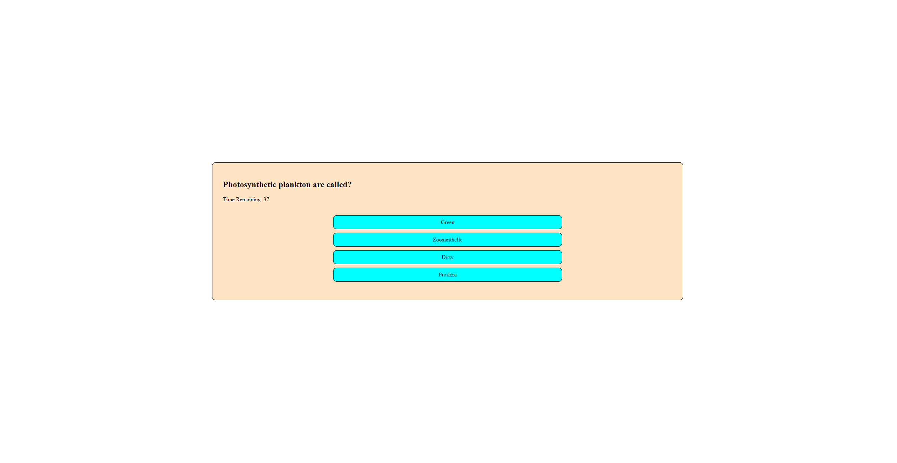

# Web APIs: Code Quiz 

## User Story

```
Build a timed coding quiz with multiple-choice questions. 
This app will run in the browser and will feature dynamically updated HTML and CSS powered by JavaScript code that you write. 
It will have a clean, polished, and responsive user interface.
```

## Acceptance Criteria

```
GIVEN I am taking a code quiz
WHEN I click the start button
THEN a timer starts and I am presented with a question
WHEN I answer a question
THEN I am presented with another question
WHEN all questions are answered or the timer reaches 0
THEN the game is over
WHEN I answer a question incorrectly
THEN time is subtracted from the clock
WHEN the game is over
THEN I can save my initials and my score
```

## Mock-Up

The following link will lead you to a live version of the webpage:

[Coding Quiz](https://yockaflocka.github.io/code-quiz/)

Here is a screenshot of the Quiz!

